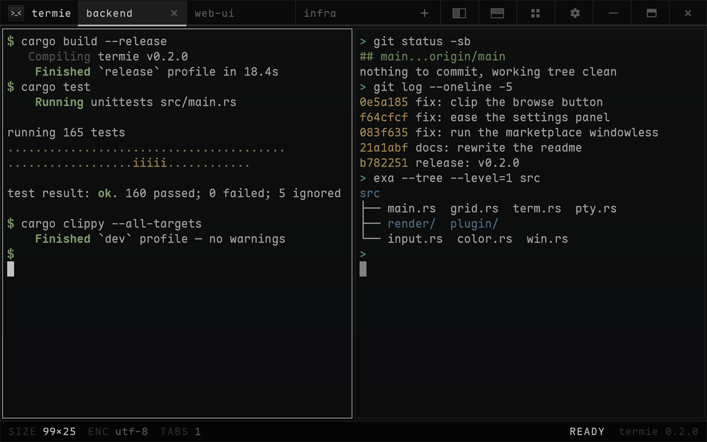

# termie

A fast, lightweight GPU terminal multiplexer for Windows and Linux — tabs, split panes, and many shells across many repos in one window.



- downloads: [GitHub Releases](https://github.com/zeo/termie/releases) (Windows x64 installer; Linux x86-64 archive)
- plugins: registry at [`zeo/termie-plugins`](https://github.com/zeo/termie-plugins)
- license: MIT OR Apache-2.0

> Early but daily-usable. Windows and Linux (X11 and Wayland) run the same rendering, emulation, and plugin core. The global Quake hotkey is Windows-only.

## features

GPU-rendered (wgpu glyph-atlas), a ~8.8 MB binary, and a lean dependency tree. A pre-warmed shell pool keeps the default shell ready, so new tabs and splits feel instant and the window appears before any shell finishes spawning.

Tabs and recursive split panes: split vertically or horizontally, drag tabs to reorder them, dock live panes on any side of another pane, move panes between Termie windows, tear tabs or panes into their own window, and broadcast input to every pane in a tab. Splits and "new tab here" open in the focused pane's directory; pick a per-tab shell from the command palette: `pwsh` / `cmd` / `wsl` on Windows, `bash` / `zsh` / `fish` on Linux, plus any custom profile. A bell in a background tab dots that tab, and a bell while the window is unfocused asks for attention (a taskbar flash on Windows, the window-manager's urgency hint on Linux), so a finished agent or build finds you first. Right-click the pinned launcher for a new window, a built-in shell, or any custom profile on either OS (`termie --shell bash` from a script does the same everywhere).

Drag a tab out to make a window, or drop it into any other ordinary Termie window to combine them again. Starting Termie from a shortcut, shell, launcher, or `Ctrl+Shift+N` opens that window inside the running app, so live tabs and panes can move between them. Each move keeps the pane tree, shell processes, title, color, and status. Docking the final tab or pane closes the emptied source window.

Real terminal emulation: a [vte](https://github.com/alacritty/vte)-based parser, alt screen, scroll regions, mouse reporting, bracketed paste, OSC 7 cwd (tab labels + window title), reflow on resize, the kitty keyboard protocol (so `Shift+Enter` inserts a newline in TUIs), OSC 8 hyperlinks, OSC 52 clipboard writes, OSC 4/10/11/12 color queries, OSC 9;4 taskbar progress, underline styles, strikethrough, blink, and DEC 2026 synchronized output for tear-free frames.

Inline images via the kitty graphics protocol (raw RGB / RGBA / PNG, cursor flow like kitty's, z-index stacking, scoped deletes, unicode placeholders so images survive tmux and scrollback) and sixel — `img2sixel`, `chafa`, `lsix`, and anything else that probes DA1 finds both — plus full-color emoji, all packed into a dedicated RGBA atlas beside the glyph cache. On Windows, installs ship a current ConPTY host (`conpty.dll` + `OpenConsole.exe`, MIT, from microsoft/terminal) beside the exe, because the ConPTY built into Windows strips sixel before a terminal ever sees it; on Linux the kernel pty passes every byte through untouched, so nothing extra is needed. IME composition, a screen-reader path via AccessKit, and session restore (tab + split layout) with crash recovery.

Termie can be the **default terminal**: run "default terminal" from the palette once. On Windows 11, console apps launched from the run box, the start menu, or a double-clicked script open in a Termie window instead of the legacy console host. On KDE Plasma and Linux desktops that use `xdg-terminal-exec`, terminal launchers and `Terminal=true` desktop apps open in Termie. The same palette action turns it back off, restores the previous choice, and uninstalling removes Termie's selection.

"New admin window" opens the focused directory with an elevated shell. Windows uses its UAC relaunch; Linux keeps the graphical process in the desktop session and elevates only the new PTY through Polkit, with `sudo` as the fallback.

A command palette (`Ctrl+P`) for fuzzy access to every action, plus a searchable numbered tab switcher (`tab search` in the palette) for crowded windows. Seven built-in themes — three house schemes plus Catppuccin Mocha, Gruvbox, Tokyo Night, and Nord — a bundled Maple Mono Nerd Font, adjustable font size / padding / cursor / opacity, and per-user `colors.conf` and `keybindings.conf`. Windows, Linux X11, and KDE Plasma Wayland have an optional Quake-style drop-down (`quake_key`).

A plugin system: plugins run as separate processes over a small JSON protocol, render widgets in a side dock (text or drawn graphics), talk over an in-process bus, and can be confined to an OS sandbox — a Windows AppContainer or a Linux [bubblewrap](https://github.com/containers/bubblewrap) jail. An in-app marketplace browses and installs them.

## install

**Windows.** Download `termie-<version>-setup.exe` from the [latest release](https://github.com/zeo/termie/releases/latest) and run it — a small native installer in termie's own style, not a wizard. It installs per-user (no admin prompt), and the options are right on its one page: `PATH`, Start-menu and desktop shortcuts, and the "Open in termie" right-click entry. It shows up in Add/Remove Programs, replaces any older install (including the previous MSI, after asking), and uninstalls cleanly. The build is unsigned, so SmartScreen may warn first: **More info → Run anyway**.

termie checks for a newer release once a day and shows a small `UPDATE` chip on the status bar when one exists. Clicking it (or running "update termie" from the palette) verifies the release asset, installs the new version, and relaunches with your session restored; nothing downloads without that confirmation. Linux archive installs update in place. Package-manager and source builds keep their owner and open the release page. Turn the check off entirely with `update_check=false` in `config`. An MSI is still attached to each release for anyone scripting Windows installs.

**Linux.** Download `termie-<version>-linux-x86_64.tar.gz`, extract it, and run `./install.sh`. The default prefix is `~/.local`; pass an absolute prefix such as `/usr/local` to install elsewhere. `./uninstall.sh` uses the same prefix. The archive includes the desktop entry, icon, licenses, and bundled assets. Termie runs on X11 and Wayland; a working Vulkan or GL driver is all the GPU side needs.

## keybindings

| key | action |
|---|---|
| `Ctrl+T` / `Ctrl+W` | new / close tab |
| `Ctrl+Shift+D` | duplicate tab (same shell and directory) |
| `Ctrl+Shift+N` | new window (same shell and directory) |
| `Ctrl+Tab` / `Ctrl+1`..`9` | next / nth tab |
| `Ctrl+Shift+PgUp` / `Ctrl+Shift+PgDn` | move tab left / right (tabs also drag to reorder) |
| `Ctrl+Shift+E` / `Ctrl+Shift+O` | split vertical / horizontal |
| `Ctrl+P` | command palette |
| `Ctrl+Shift+P` | pane mode (move / resize / zoom / close) |
| `Ctrl+Shift+M` | mark mode (arrows move, Ctrl+arrows jump words, Shift extends, Enter copies) |
| `Ctrl+Shift+A` | select all text in the focused pane |
| `Ctrl+Shift+C` / `Ctrl+Shift+V` | copy / paste (also `Ctrl+Insert` / `Shift+Insert`) |
| `Ctrl+Shift+F` | find in scrollback |
| `Ctrl+Shift+B` | broadcast input to every pane |
| `Ctrl+Alt+A` | jump to the next pane that failed, rang, or finished |
| `Ctrl+Shift+W` | close pane |
| `Ctrl+Up` / `Ctrl+Down` | jump to previous / next prompt (marked on the scrollbar) |
| `Shift+PgUp` / `Shift+PgDn` | scroll a page of history |
| `Ctrl+Shift+Home` / `Ctrl+Shift+End` | scroll to the top / bottom |
| `F11` | fullscreen |
| `Ctrl`+wheel | font zoom |

Every binding is rebindable (or unbindable) in `keybindings.conf`; the full list is in the command palette.

## shells

Windows auto-detects `pwsh` → `powershell` → `cmd`, with WSL selectable. Linux auto-detects `bash` → `zsh` → `fish` → `pwsh`. PowerShell launches `-NoLogo -NoProfile` unless profile loading is enabled. Bash, zsh, fish, PowerShell, and CMD emit prompt, command-start, command-finished, exit-status, and current-directory marks where the shell exposes them. These marks drive prompt navigation, status badges, scrollbar marks, tab labels, and "new tab here".

Any other shell works as a custom profile — add `profile.<name>=<command line>` to `config` (quote paths with spaces):

    profile.git-bash="C:\Program Files\Git\bin\bash.exe" -i -l
    profile.nu=nu.exe

Each profile shows up on the palette as `new tab: <name>`, can be bound in `keybindings.conf` by that same label, restores with the session, and duplicates like the built-in shells. A profile name also works as the `shell` default.

A shell or profile can carry its own theme — `theme.<name>=<theme>` paints that shell's panes with a different palette while the window chrome keeps the global theme, so a WSL split reads apart from your PowerShell pane at a glance:

    theme.wsl=gruvbox
    theme.git-bash=nord

## configuration

Configuration lives in `%APPDATA%\termie\` on Windows. Linux follows the XDG base-directory split: configuration in `$XDG_CONFIG_HOME/termie` (usually `~/.config/termie`), plugins in `$XDG_DATA_HOME/termie`, session state and logs in `$XDG_STATE_HOME/termie`, and generated shell hooks plus the update stamp in `$XDG_CACHE_HOME/termie`. Existing Linux files migrate from the old config directory on first use.

- `config` — general settings the in-app panel also writes (`shell`, `theme`, `scrollback`, …). Opt-ins live here too: `quake_key=ctrl+grave` on Windows or Linux, `plugin_sandbox=appcontainer` on Windows or `plugin_sandbox=bwrap` on Linux, `latency_hud=true`, `acrylic=true` for Windows Mica or Linux compositor blur, `right_click=paste`, `term_program=ghostty`, `font_weight=semibold`, `min_contrast=3`, `background_image=<path.png>` with `background_image_opacity=0.3`, and `ligatures=false`.
- `colors.conf` — override theme colors, one `key=color` per line (`fg`, `bg`, `cursor`, `sel`, `ansi0`..`ansi255`; `#rrggbb`, `#rgb`, or `r,g,b`).
- `keybindings.conf` — rebind keys, one `combo=action` per line, e.g. `ctrl+alt+t=new tab here`.

Mistyped lines are reported to `termie.log` in the state directory.

The command line takes Windows Terminal's layout verbs too: `termie new-tab -d ~/src ; split-pane -H --shell bash` opens a window with that layout (`nt`/`sp` for short; `-V` splits beside and is the default, `-H` below). Scripted windows never overwrite your saved session. For automation and demos, `--drive script.txt` plays timed input through the normal handlers: `500 key ctrl+shift+m`, `100 type hello`, `50 pointer 320 140`, and `0 mouse down` / `100 mouse up`. Pointer coordinates are client pixels and may sit outside the window to exercise tab or pane tear-out. Windows creates this window without activation. Linux compositors control activation, so a drive window can receive focus there.

## build from source

Requires the [Rust toolchain](https://rustup.rs/) (stable).

**Windows:**

```powershell
git clone https://github.com/zeo/termie
cd termie
powershell -ExecutionPolicy Bypass -File install.ps1
```

This builds in release, installs to `%LOCALAPPDATA%\Programs\termie`, bundles the fonts, adds the directory to your user `PATH`, and registers an "Open in termie" context-menu entry. Restart your shell, then run `termie`. Remove it with `uninstall.ps1`. To run without installing, use `cargo run --release`.

**Linux** needs the windowing and input development headers before building. On Debian/Ubuntu:

```sh
sudo apt install pkg-config libwayland-dev libxkbcommon-dev libx11-dev \
                 libxcursor-dev libxi-dev libxrandr-dev unzip
# Fedora: pkgconf-pkg-config wayland-devel libxkbcommon-devel libX11-devel \
#         libXcursor-devel libXi-devel libXrandr-devel
# Arch:   pkgconf wayland libxkbcommon libx11 libxcursor libxi libxrandr

git clone https://github.com/zeo/termie
cd termie
cargo build --release      # target/release/termie
```

At runtime the binary needs those same libraries, `unzip` for marketplace installs, and a Vulkan or GL driver. `mesa-vulkan-drivers` covers the software fallback. Optional: `systemd-run` isolates each pane for independent out-of-memory handling, `bubblewrap` confines plugins, and `xdg-open` opens links. `theme=auto` reads and monitors the desktop color scheme through `xdg-desktop-portal` using `gdbus`. Copy `assets/fonts/` next to a source-built binary (or run from the repo); the release archive already carries them.

Every platform:

```sh
cargo build            # debug
cargo test             # unit tests (incl. golden snapshots)
cargo clippy --all-targets
cargo build --release  # optimized
```

## plugins

Plugins are separate processes termie talks to over newline-delimited JSON, so a plugin can be written in any language and be as heavy as it likes while the core stays lean. They render widgets in a side dock — Tier-1 text or Tier-2 immediate-mode graphics — talk to each other over an in-process bus, and can be confined to an OS sandbox (opt-in): a Windows AppContainer, or a bubblewrap jail on Linux that shows the plugin only its own install directory and grants network only with the `network` permission. The in-app marketplace (palette → "plugins") browses, installs, enables/disables, and removes them; the registry — plugin source plus the catalog — lives at [`zeo/termie-plugins`](https://github.com/zeo/termie-plugins), which is also where you contribute one.

## license

Dual-licensed under either [MIT](LICENSE-MIT) or [Apache-2.0](LICENSE-APACHE), at your option. Bundled fonts and other third-party material keep their own licenses — see [THIRDPARTY.md](THIRDPARTY.md).

## built with

[wgpu](https://github.com/gfx-rs/wgpu) · [winit](https://github.com/rust-windowing/winit) · [vte](https://github.com/alacritty/vte) · [portable-pty](https://github.com/wezterm/wezterm/tree/main/pty) · [cosmic-text](https://github.com/pop-os/cosmic-text)
